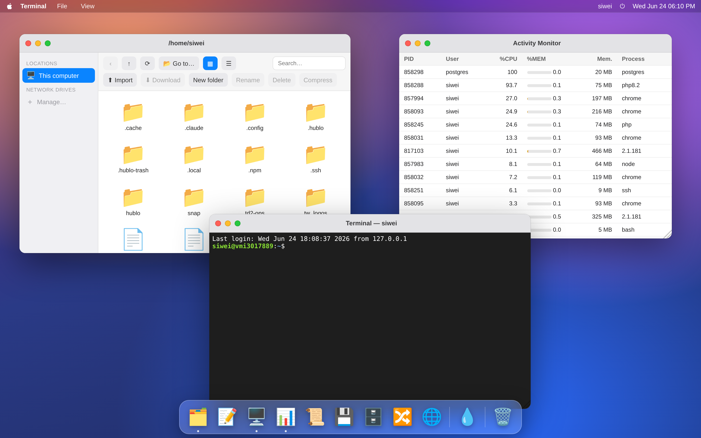

# Hublo

> A macOS-style web desktop to manage your space on a Linux server — securely, without the command line.



Hublo is a self-hosted web app that gives you a familiar desktop (windows, Dock, Finder) **in the browser** to act inside **your own space** on a Linux server: browse/edit/move files, follow logs, inspect disk usage, run a terminal, query a Postgres database, use Git, and more — all **as your Unix user**, so the kernel's own permissions are the security boundary. The gateway never runs as root.

It started as a way to let a non-technical teammate operate safely on a server without the terminal, and grew into a small "web OS" of practical sysadmin / dev tools — **extensible with more apps from a built-in App Store** (see below).

## Why it's safe (the core idea)

When you log in, the Hublo gateway opens an **SSH session to `localhost` as you** and performs every action through it:

- files via **SFTP**, the terminal via a real **PTY**, everything else via `exec`;
- so Hublo can only ever do what **your Unix account** can already do — it's a friendly GUI over your own SSH access, **not** a privilege escalation;
- the gateway process runs **non-root** (`NoNewPrivileges`), and only **allow-listed** accounts may log in.

```
 Browser (Vue desktop) ──HTTPS / WSS──>  Hublo gateway (Node)  ──SSH as you──>  your Linux user
   Finder, Terminal, …                   Fastify + ssh2 (never root)            SFTP / PTY / exec
```

## Features

### Built-in apps

- **Finder** — file manager with icon/list views, navigation, create/rename/delete, **upload/download**, **drag & drop**, search, archives (`.tar.gz` / unzip), properties + **Unix permissions (chmod)**, **Trash** (per host).
- **Network drives** — register SSH hosts and browse/edit them like local; **real server-to-server transfer**.
- **Multiple windows** — several Finder/Terminal windows, shared clipboard, drag a file from one window to another.
- **TextEdit** — Monaco (the VS Code editor) with syntax highlighting.
- **Terminal** — a real shell (xterm.js over a PTY).
- **Logs** — live `tail -f` / `journalctl -f` with client-side filtering.
- **Storage** — disk-usage analyzer (`du` / `df`), drill down by size.
- **Git** — status, colored diff, stage/unstage, commit, pull/push, history.
- **Activity Monitor**, **System Info**, **Preview** (images & PDF), and more.

### Installable from the App Store

These are no longer bundled by default — install them from the **App Store** (🛍️ in the Dock):

- **HTTP Client** — a Postman-style request builder (method, headers, body, response viewer, history).
- **Database** — a PostgreSQL client (connection manager, table browser, SQL editor, results).

See **[App Store & community apps](#app-store--community-apps)** for how this works and how to publish your own.

## App Store & community apps

Beyond the built-in apps, Hublo has a built-in **App Store** (🛍️ in the Dock) to install more — and the community can publish their own. Apps are listed in a separate registry repo: **[adsofts/hublo-apps](https://github.com/adsofts/hublo-apps)**; publishing is a pull request.

**How external apps stay safe.** An installed app is **frontend-only** (no server-side code) and runs in a **sandboxed `<iframe>`** with an opaque origin and a strict CSP: it has **no network of its own** and cannot read your cookies, reach the gateway directly, or touch Hublo or other apps. Its only channel is a `postMessage` **bridge** that Hublo mediates against the **permissions you granted at install** (shown in a consent dialog). So an app can never do more than you allowed — and never more than your Unix account can. Packages are pinned by **SHA-256**; apps reviewed by the maintainers show as **Verified**, others as **Community** (same sandbox either way).

The first two store apps are the **HTTP Client** and the **Database** client (previously built-in).

- **Build an app:** start with the [developer guide](https://github.com/adsofts/hublo-apps/blob/main/docs/developer-guide.md); apps target the [`hublo` SDK and UI pack](https://github.com/adsofts/hublo-apps/tree/main/sdk).
- **Full design & roadmap:** [`docs/app-store-design.md`](docs/app-store-design.md).

> By default the gateway reads the catalog from the public `hublo-apps` registry; point it elsewhere (a fork, or a local checkout) with `HUBLO_APPS_SRC`.

## Tech stack

- **Frontend** — Vue 3 + Vite + Pinia, Monaco, xterm.js (a custom macOS-like window manager; no UI framework).
- **Gateway** — Node.js + Fastify + [`ssh2`](https://github.com/mscdex/ssh2) (SFTP / PTY / exec) + [`pg`](https://node-postgres.com/) (Postgres).
- No database of its own; per-user config (network drives, DB connections, installed apps) lives in the user's `~/.hublo/`.

## Requirements

- A **Linux host** with `sshd`, running **Node.js 20+**.
- The accounts you want to use must **already exist** on that host (Hublo logs you in as a real Unix user).
- `git`, `tar`, `unzip`, `journalctl`/`tail` for the matching apps (standard on most servers). Postgres is only needed if you install the Database app; `curl` for the HTTP Client app.

## Install & run

```bash
git clone https://github.com/adsofts/hublo.git
cd hublo

# 1) Gateway dependencies
npm install

# 2) Build the web UI (outputs to ./public)
npm run build

# 3) Allow password SSH FROM LOCALHOST ONLY — the gateway authenticates you this way
sudo tee /etc/ssh/sshd_config.d/99-hublo-localhost.conf >/dev/null <<'EOF'
Match Address 127.0.0.1,::1
    PasswordAuthentication yes
    KbdInteractiveAuthentication yes
EOF
sudo sshd -t && sudo systemctl reload ssh

# 4) Run the gateway (binds 127.0.0.1:8787 by default)
HUBLO_ALLOWED="$USER" npm start
```

Then open **http://127.0.0.1:8787** and log in with your **Linux username + password**.

> The gateway binds to `127.0.0.1` by default. To reach it from another machine, put it behind a reverse proxy with **TLS and WebSocket support** (the session cookie is `Secure` over HTTPS). For quick local-network testing only, you can set `HOST=0.0.0.0` (no TLS — never do this in production).

### Configuration (environment variables)

| Variable | Default | Meaning |
|---|---|---|
| `PORT` | `8787` | Gateway port |
| `HOST` | `127.0.0.1` | Bind address |
| `HUBLO_ALLOWED` | the gateway's own `$USER` | Comma-separated Unix accounts allowed to log in (e.g. `alice,bob`) |
| `HUBLO_APPS_SRC` | the public `hublo-apps` registry (GitHub raw) | App Store catalog source — a base URL or a local path (e.g. a fork or a local checkout) |

### Run as a service (systemd)

```ini
[Unit]
Description=Hublo gateway
After=network.target

[Service]
Type=simple
User=youruser
WorkingDirectory=/path/to/hublo
Environment=PORT=8787
Environment=HUBLO_ALLOWED=alice,bob
ExecStart=/usr/bin/node /path/to/hublo/server.js
Restart=on-failure
NoNewPrivileges=true

[Install]
WantedBy=multi-user.target
```

Then front it with Apache/nginx/Caddy doing TLS + WebSocket proxying for `/` and `/ws/*`.

## Security notes & limitations

- **This is a proof of concept.** It gives a friendly interface over *your own* SSH access — treat reaching it as equivalent to reaching those accounts.
- Always run it **behind TLS**, restrict who can connect (VPN / firewall / allow-list), keep `HUBLO_ALLOWED` tight, and **never run the gateway as root**.
- Per-user secrets (passwords for remote network drives / DB connections) are stored in the user's `~/.hublo/*.json` (`chmod 600`, in their home). Prefer SSH **keys** over passwords for network drives.
- Cross-host *file* transfers stream through the gateway; very large trees can be slow.
- Logins and file mutations are appended to `logs/audit.log`.

## Project layout

```
server.js            # the Node gateway (auth, SFTP/PTY/exec, app + store APIs)
web/                 # the Vue 3 desktop (source) — `npm run build` outputs to ../public
public/              # built UI served by the gateway (generated; gitignored)
store-assets/        # SDK + UI pack inlined into the sandbox frame for installed apps
docs/app-store-design.md   # the App Store design (sandbox, capabilities, registry)
```

> The companion repo **[adsofts/hublo-apps](https://github.com/adsofts/hublo-apps)** holds the app registry, the SDK, the UI pack, and the developer guide.

## Translations

The UI ships in **English** (default) and **French**, and is fully translatable (vue-i18n). Switch language from the **🍎 menu**; the choice is remembered (`localStorage`).

To add a language:

1. Copy `web/src/locales/en.js` to `web/src/locales/<code>.js` and translate the values.
2. Register it in `web/src/i18n.js` (the `messages` map) and add an entry to the language switcher in `web/src/components/MenuBar.vue`.
3. `npm run build`.

Community translations are very welcome — PRs appreciated.

## Status

Active proof of concept, evolving quickly. Issues and ideas welcome.

## License

[MIT](LICENSE) © adsofts
